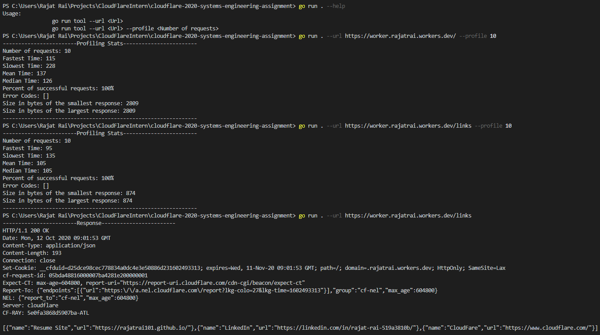
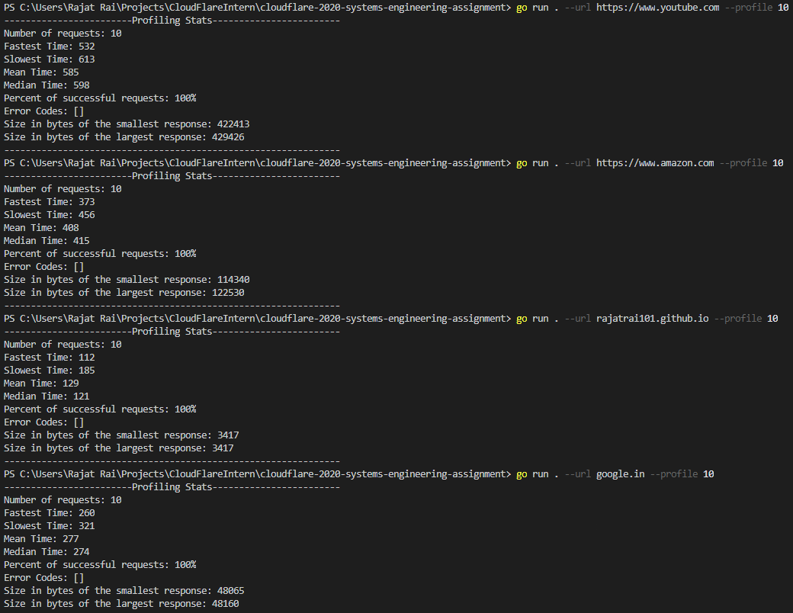
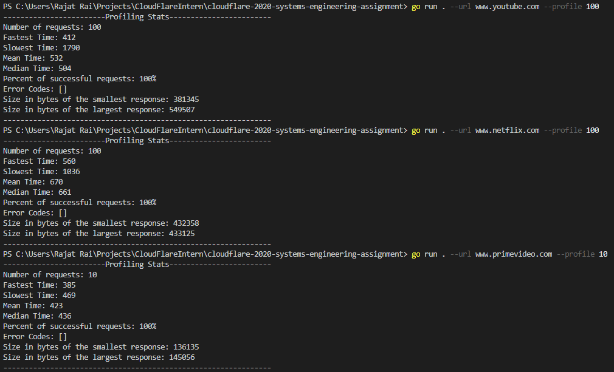

# Systems Assignment 
Language: Go Lang

## What is it?

This exercise is a follow-on to the [General Assignment](https://github.com/cloudflare-hiring/cloudflare-2020-general-engineering-assignment). This tool makes a request to a given HTTP endpoint using TLS sockets, and prints the response or profiles the URL link for a given number of requests.  

### Note: No Http Libraries were used for developing this tool.

## Setup and usage
- Install go.
- git close repo
- cd ./repo/
- Usage:
    - go run . --help
    - go run . --url [URL]
    - go run . --url [URL] --profile [Number of requests]

## Results

## Highlights
* Connections are made using tls sockets.
* Use of go routines and channels
* Redirects will be followed until a "Success" or "Error" status is returned 
* Connection request will timeout after 5 seconds of no response
